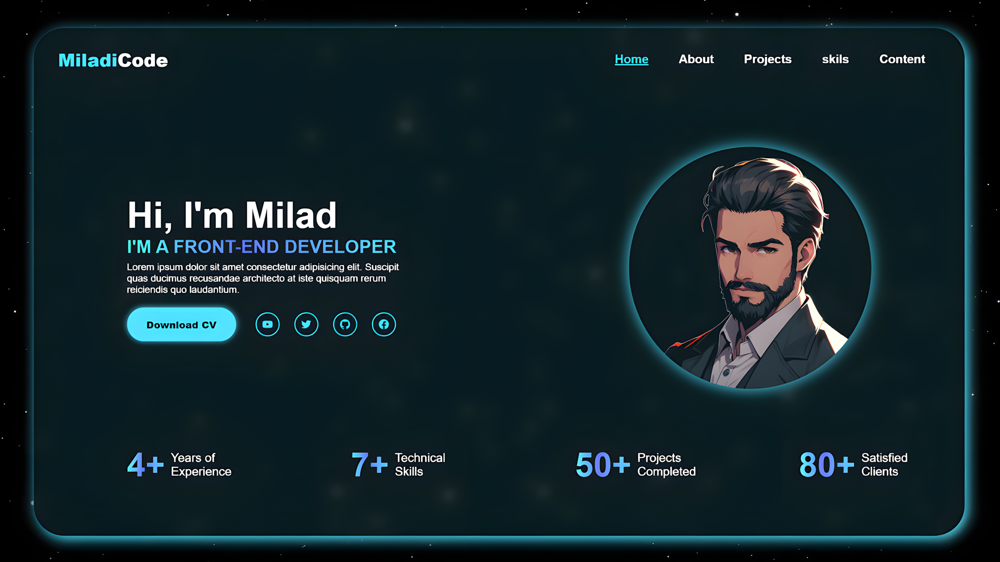

---
## Introduction: 
#### 🚀 Build a Modern Personal Portfolio with HTML and CSS 🌟

#### In this video, I’ll show you how to create a personal portfolio using just HTML and CSS. This modern portfolio design includes a clean navbar, an eye-catching hero section, and stylish info cards with a stunning text gradient effect. Whether you're a beginner or an aspiring frontend developer, this tutorial is perfect for building a responsive portfolio that showcases your skills!

---
## Watch the full tutorial on YouTub
